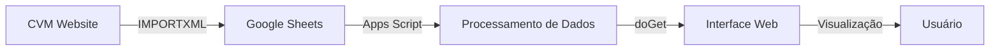

# 🚀 Gerenciador CVM BANESTES - Automação de Fundos de Investimento

<div align="center">


### **Sistema de monitoramento automatizado de 26 fundos de investimento BANESTES**

*Integração direta com dados oficiais da CVM via Google Sheets*

[🎯 Visão Geral](#-visão-geral) • [🏗️ Arquitetura](#-arquitetura-do-sistema) • [⚡ Funcionalidades](#-funcionalidades-principais) • [📊 Abas Monitoradas](#-abas-e-dados-monitorados) • [🚀 Instalação](#-instalação-e-configuração)

</div>

---

## 🎯 Visão Geral

O **Gerenciador CVM BANESTES** é uma aplicação web desenvolvida em **Google Apps Script** que automatiza a coleta, processamento e visualização de dados dos fundos de investimento do BANESTES, integrando-se diretamente com a base oficial da **Comissão de Valores Mobiliários (CVM)**.

### 🌟 Propósito

Substituir o processo manual de consulta de dados da CVM por um sistema automatizado que:
- 📊 Monitora **26 fundos de investimento** BANESTES em tempo real
- 🔄 Integra dados oficiais via **fórmulas IMPORTXML** no Google Sheets
- 📱 Apresenta informações em **dashboard web responsivo**
- 📅 Calcula automaticamente **datas úteis** considerando feriados brasileiros
- ✅ Valida **conformidade** e status de atualização dos fundos

### 💡 Tecnologias Utilizadas

| Tecnologia | Uso | Percentual |
|-----------|-----|-----------|
| **JavaScript (Apps Script)** | Backend serverless, lógica de negócios | 75.8% |
| **HTML5 + CSS3** | Interface web, dashboard responsivo | 24.2% |
| **Google Sheets** | Banco de dados, armazenamento | - |
| **IMPORTXML** | Integração com dados CVM | - |

---

## 🏗️ Arquitetura do Sistema

### Stack Tecnológico

```
┌─────────────────────────────────────────────────────────────────┐
│                    CAMADA DE APRESENTAÇÃO                        │
│  ┌────────────────────────────────────────────────────────┐    │
│  │  Interface Web (Index.html - 39.7KB)                   │    │
│  │  • Dashboard responsivo com HTML5/CSS3                 │    │
│  │  • Visualização de status e dados dos fundos           │    │
│  │  • Design moderno com gradientes e animações           │    │
│  └────────────────────────────────────────────────────────┘    │
└─────────────────────────────────────────────────────────────────┘
                               ⬇️
┌─────────────────────────────────────────────────────────────────┐
│                  CAMADA DE LÓGICA DE NEGÓCIO                     │
│  ┌────────────────────────────────────────────────────────┐    │
│  │  Google Apps Script Backend                            │    │
│  │  • Code.gs (91KB) - Core principal                     │    │
│  │  • DateUtils.gs (18.5KB) - Cálculos de data           │    │
│  │  • FundoService.gs (3.7KB) - Gestão de fundos         │    │
│  │  • ConfigData.gs (5.7KB) - Configurações              │    │
│  │  • onInstall.gs (30.2KB) - Instalador automatizado    │    │
│  └────────────────────────────────────────────────────────┘    │
└─────────────────────────────────────────────────────────────────┘
                               ⬇️
┌─────────────────────────────────────────────────────────────────┐
│                    CAMADA DE DADOS                               │
│  ┌────────────────────────────────────────────────────────┐    │
│  │  Google Sheets (Base de Dados)                         │    │
│  │  • 9 Abas estruturadas                                 │    │
│  │  • Fórmulas IMPORTXML para coleta automática          │    │
│  │  • Named ranges para referências                       │    │
│  └────────────────────────────────────────────────────────┘    │
└─────────────────────────────────────────────────────────────────┘
                               ⬇️
┌─────────────────────────────────────────────────────────────────┐
│                   FONTE DE DADOS OFICIAL                         │
│  ┌────────────────────────────────────────────────────────┐    │
│  │  CVM - Comissão de Valores Mobiliários                │    │
│  │  • cvmweb.cvm.gov.br                                   │    │
│  │  • Dados regulatórios oficiais                         │    │
│  └────────────────────────────────────────────────────────┘    │
└─────────────────────────────────────────────────────────────────┘
```

### Fluxo de Dados



---

## 📁 Estrutura de Arquivos

### Arquivos do Projeto

```
Banestes_Gerenciador_CVM/
│
├── 📄 Code.gs (91.3 KB)
│   ├── doGet() - Entry point da aplicação web
│   ├── getDashboardData() - API principal de dados
│   ├── lerAbaBalancete() - Lê dados da aba Balancete
│   ├── lerAbaComposicao() - Lê dados da aba Composição
│   ├── lerAbaDiarias() - Lê dados da aba Diárias
│   ├── lerAbaLamina() - Lê dados da aba Lâmina
│   ├── lerAbaPerfilMensal() - Lê dados da aba Perfil Mensal
│   ├── buscarCodigoBanestes() - Busca código interno do fundo
│   └── getStatusInstalacao() - Verifica status da instalação
│
├── 📄 FundoService.gs (3.7 KB)
│   ├── getFundos() - Retorna array com 26 fundos BANESTES
│   └── getTotalFundos() - Retorna contagem total de fundos
│
├── 📄 DateUtils.gs (18.5 KB)
│   ├── getDatasReferencia() - Calcula datas de referência
│   ├── calcularProximoDiaUtil() - Calcula próximo dia útil
│   ├── isFeriado() - Verifica se data é feriado
│   ├── isDiaUtil() - Verifica se data é dia útil
│   ├── criarAbaApoioComValores() - Cria aba APOIO com valores
│   └── verificarAbaApoio() - Valida estrutura da aba APOIO
│
├── 📄 ConfigData.gs (5.7 KB)
│   ├── getFeriadosBrasileiros() - Calendário 2025-2030
│   └── getFeriados() - Alias para compatibilidade
│
├── 📄 onInstall.gs (30.2 KB)
│   ├── setupCompletoAutomatico() - Setup completo da planilha
│   ├── criarEstruturaPlanilhaCompleta() - Cria 9 abas
│   ├── preencherAbaCodFundo() - Preenche aba COD FUNDO
│   ├── preencherAbaFeriados() - Preenche aba FERIADOS
│   ├── preencherAbaApoio() - Preenche aba APOIO com fórmulas
│   ├── criarFormulasBalancete() - Cria fórmulas para Balancete
│   ├── criarFormulasComposicao() - Cria fórmulas para Composição
│   ├── criarFormulasDiarias() - Cria fórmulas para Diárias
│   ├── criarFormulasLamina() - Cria fórmulas para Lâmina
│   └── criarFormulasPerfilMensal() - Cria fórmulas para Perfil Mensal
│
├── 📄 Index.html (39.7 KB)
│   ├── <head> - Metadados e configurações
│   ├── <style> - CSS responsivo com gradientes
│   ├── <body> - Estrutura HTML do dashboard
│   └── <script> - JavaScript para carregamento de dados
│
├── 📄 conformidade.html (3.6 KB)
│   └── Template HTML para emails de conformidade
│
├── 📄 desconformidade.html (4.4 KB)
│   └── Template HTML para emails de alerta
│
└── 📄 README.md
    └── Esta documentação
```

### 📊 Estatísticas do Código

| Métrica | Valor |
|---------|-------|
| **Total de Arquivos** | 9 arquivos |
| **Tamanho Total** | ~233 KB |
| **Linguagens** | JavaScript (Apps Script), HTML5, CSS3 |
| **Linhas de Código** | ~5.500+ linhas |
| **Fundos Gerenciados** | 26 fundos BANESTES |
| **Feriados Programados** | 78 feriados (2025-2030) |
| **Abas Monitoradas** | 5 abas de dados + 4 auxiliares |

---

## ⚡ Funcionalidades Principais

### 🤖 Automação de Dados

- ✅ **Integração Automática com CVM**
  - Fórmulas `IMPORTXML()` no Google Sheets coletam dados diretamente do site da CVM
  - Parsing estruturado de HTML/XML dos endpoints oficiais
  - Atualização automática quando a planilha é aberta ou recalculada

- ✅ **Leitura de 5 Abas Especializadas**
  - **Balancete**: Status de balancetes dos fundos
  - **Composição**: Composição de carteira
  - **Diárias**: Cotas diárias dos fundos
  - **Lâmina**: Lâminas de informações essenciais (CVM)
  - **Perfil Mensal**: Performance mensal dos fundos

- ✅ **Processamento Inteligente de Dados**
  - Valida status de atualização (OK, EM CONFORMIDADE, DESATUALIZADO)
  - Calcula dias restantes até prazo limite
  - Identifica código BANESTES de cada fundo
  - Gera status geral por categoria

### 📅 Sistema de Datas Inteligente

- ✅ **Calendário de Feriados Nacionais**
  - Programado com 78 feriados de 2025 a 2030
  - Inclui: Ano Novo, Carnaval, Páscoa, Tiradentes, Dia do Trabalho, Corpus Christi, Independência, N.Sra. Aparecida, Finados, Proclamação da República, Natal, etc.

- ✅ **Cálculo de Dias Úteis**
  - Ignora sábados, domingos e feriados
  - Calcula próximo dia útil automaticamente
  - Identifica última data útil do mês
  - Suporte a zona horária brasileira (BRT/BRST)

- ✅ **Datas de Referência Automáticas**
  - Data de referência do mês atual
  - Data de referência do mês anterior (DIAMESREF2)
  - Cálculo de prazos de envio (10 dias úteis)
  - Validação de conformidade baseada em datas

### 📊 Dashboard Web Responsivo

- ✅ **Interface Moderna**
  - Design com gradientes azuis (identidade BANESTES)
  - Animações CSS suaves (transitions 0.3s)
  - Layout responsivo para desktop, tablet e mobile
  - Cards com sombras e efeitos hover

- ✅ **Visualização de Dados**
  - Status geral de cada categoria (Balancete, Composição, etc.)
  - Listagem detalhada de fundos com status individual
  - Indicadores visuais coloridos (verde=OK, amarelo=conformidade, vermelho=desatualizado)
  - Botão de atualização para recarregar dados

- ✅ **Carregamento Assíncrono**
  - Spinner de loading durante carregamento
  - Chamadas assíncronas via `google.script.run`
  - Tratamento de erros com mensagens amigáveis
  - Tempo de resposta otimizado

### 💼 Gerenciamento de 26 Fundos

<details>
<summary><b>📈 Lista Completa de Fundos BANESTES</b></summary>

1. BANESTES INVEST AUTOMÁTICO FUNDO DE APLICACAO EM QUOTAS DE FUNDOS DE INVESTIMENTO DE RENDA FIXA CURTO PRAZO
2. BANESTES INVEST MONEY FUNDO DE INVESTIMENTO DE RENDA FIXA CURTO PRAZO
3. BANESTES SOLIDEZ AUTOMÁTICO FIC RENDA FIXA CURTO PRAZO
4. BANESTES PÚBLICO AUTOMÁTICO FIC RENDA FIXA CURTO PRAZO
5. BANESTES VIP DI FIC RF
6. BANESTES VITÓRIA 500 FIC RENDA FIXA
7. BANESTES TESOURO REFERENCIADO DI FIC RENDA FIXA
8. BANESTES VALORES REFERENCIADO DI FIC RENDA FIXA
9. BANESTES LIQUIDEZ FIC RENDA FIXA SIMPLES
10. BANESTES FUNDO DE INVESTIMENTO RENDA FIXA RESERVA CLIMÁTICA
11. BANESTES IMA-B FUNDO DE INVESTIMENTO DE RENDA FIXA LONGO PRAZO
12. BANESTES IMA-B 5 FIC RENDA FIXA LONGO PRAZO
13. BANESTES IRF-M 1 FIC RENDA FIXA LONGO PRAZO
14. BANESTES BTG PACTUAL ABSOLUTO INSTITUCIONAL FUNDO DE INVESTIMENTO EM AÇÕES
15. BANESTES DIVIDENDOS FUNDO DE INVESTIMENTO EM COTAS DE FUNDOS DE INVESTIMENTO EM AÇÕES
16. BANESTES TENAX AÇÕES FUNDO DE INVESTIMENTO EM COTAS DE FUNDOS DE INVESTIMENTO EM AÇÕES
17. BANESTES SYNERGY LONG ONLY FUNDO DE INVESTIMENTO EM COTAS DE FUNDOS DE INVESTIMENTO MULTIMERCADO
18. BANESTES FUNSES FUNDO DE INVESTIMENTO MULTIMERCADO
19. BANESTES MULTIESTRATÉGIA FIC MULTIMERCADO
20. BANESTES SELECTION FIC FIM CRÉDITO PRIVADO
21. BANESTES CRÉDITO CORPORATIVO I FIC FIM CRÉDITO PRIVADO
22. BANESTES INVEST FÁCIL FUNDO DE INVESTIMENTO RENDA FIXA SIMPLES
23. BANESTES SOBERANO FUNDO DE INVESTIMENTO RENDA FIXA SIMPLES
24. BANESTES FIC FI INCENTIVADOS DE INFRAESTRUTURA AÇÕES
25. BANESTES ESTRATÉGIA FUNDO DE INVESTIMENTO DE RENDA FIXA LONGO PRAZO
26. BANESTES INSTITUCIONAL FUNDO DE INVESTIMENTO MULTIMERCADO CRÉDITO PRIVADO

Cada fundo possui:
- Nome completo oficial
- Código CVM único
- Código interno BANESTES (01 a 26)

</details>

### 🔧 Sistema de Instalação Automatizado

- ✅ **Setup Completo com Um Clique**
  - Cria automaticamente 9 abas na planilha:
    - GERAL, Balancete, Composição, Diárias, Lâmina, Perfil Mensal, APOIO, FERIADOS, COD FUNDO
  - Preenche aba COD FUNDO com os 26 fundos
  - Preenche aba FERIADOS com calendário 2025-2030
  - Cria aba APOIO com fórmulas de referência de datas
  - Define named ranges para fórmulas

- ✅ **Criação Automática de Fórmulas IMPORTXML**
  - Gera fórmulas para coleta de dados da CVM
  - Configura URLs com códigos CVM de cada fundo
  - Cria fórmulas de status e validação
  - Estrutura cabeçalhos de cada aba

### 📧 Templates de Email

- ✅ **Email de Conformidade** (`conformidade.html`)
  - Template HTML responsivo com identidade visual
  - Notificação quando todos os fundos estão em conformidade
  - Design profissional com cores verde (sucesso)

- ✅ **Email de Desconformidade** (`desconformidade.html`)
  - Template HTML responsivo para alertas
  - Notificação de fundos desatualizados ou pendentes
  - Design de alerta com cores vermelhas/amarelas

---

## 📊 Abas e Dados Monitorados

### Estrutura da Planilha Google Sheets

A aplicação utiliza uma planilha Google Sheets com 9 abas estruturadas:

#### 1. **GERAL**
- Visão geral consolidada
- Status resumido de todas as categorias
- Indicadores agregados

#### 2. **Balancete**
- Status de envio de balancetes dos fundos
- Colunas: Código BANESTES, Nome do Fundo, Data do Documento, Status, Dias Restantes
- Fórmulas IMPORTXML para coleta automática da CVM
- Status geral: OK, EM CONFORMIDADE, DESATUALIZADO

#### 3. **Composição**
- Composição de carteira dos fundos
- Dados de alocação de ativos
- Data de referência da composição
- Status de atualização

#### 4. **Diárias**
- Cotas diárias dos fundos
- Valor da cota por data
- Histórico de variações
- Status de disponibilidade

#### 5. **Lâmina**
- Lâminas de informações essenciais (documento CVM obrigatório)
- Data de publicação
- Status de conformidade
- Link para documentos

#### 6. **Perfil Mensal**
- Performance mensal dos fundos
- Rentabilidade do período
- Comparativos de benchmarks
- Status de publicação

#### 7. **APOIO** (Aba auxiliar)
- Fórmulas de cálculo de datas de referência
- HOJE (data atual)
- DIAMESREF (data de referência do mês atual)
- DIAMESREF2 (data de referência do mês anterior)
- DIADDD (prazo de 10 dias úteis)
- Named ranges para uso em outras abas

#### 8. **FERIADOS** (Aba auxiliar)
- Calendário de feriados nacionais 2025-2030
- Colunas: Data, Dia da Semana, Nome do Feriado
- Utilizado para cálculo de dias úteis

#### 9. **COD FUNDO** (Aba auxiliar)
- Código BANESTES (01-26)
- Nome completo do fundo
- Código CVM oficial
- Referência cruzada para todas as operações

### Exemplo de Fórmula IMPORTXML

```
=IMPORTXML(
  "https://cvmweb.cvm.gov.br/SWB/Sistemas/SCW/CPublica/Balancete/CPublicaBalancete.asp?PK_PARTIC=" & 
  CÓDIGO_CVM & 
  "&SemFrame=",
  "/html/body/form/table/tbody/tr[1]/td/select"
)
```

---

## 🚀 Instalação e Configuração

### Pré-requisitos

| Requisito | Descrição | Status |
|-----------|-----------|--------|
| **Conta Google** | Gmail ou Google Workspace | ✅ Obrigatório |
| **Google Apps Script** | Incluído gratuitamente | ✅ Gratuito |
| **Google Sheets** | Para armazenamento de dados | ✅ Gratuito |
| **Navegador Web** | Chrome, Edge, Firefox ou Safari | ✅ Recomendado |

### 📥 Passo 1: Clonar o Repositório

```bash
# Clone via HTTPS
git clone https://github.com/SergioPauloA/Banestes_Gerenciador_CVM.git

# Ou via SSH
git clone git@github.com:SergioPauloA/Banestes_Gerenciador_CVM.git

# Entre no diretório
cd Banestes_Gerenciador_CVM
```

### ⚙️ Passo 2: Criar Projeto Google Apps Script

1. Acesse [script.google.com](https://script.google.com)
2. Clique em **"Novo projeto"**
3. Nomeie o projeto: `Gerenciador CVM BANESTES`

### 📂 Passo 3: Importar Arquivos

**Arquivos `.gs` (Scripts Google Apps):**

1. No editor do Apps Script, crie os seguintes arquivos:
   - `Code.gs`
   - `FundoService.gs`
   - `DateUtils.gs`
   - `ConfigData.gs`
   - `onInstall.gs`

2. Copie o conteúdo de cada arquivo do repositório para o editor

**Arquivos `.html` (Interface Web):**

1. Clique em **+ (Adicionar arquivo) → HTML**
2. Crie os arquivos:
   - `Index.html`
   - `conformidade.html`
   - `desconformidade.html`
3. Cole o conteúdo correspondente

### 📊 Passo 4: Criar e Configurar Google Sheets

1. Crie uma nova planilha Google Sheets
2. Copie o ID da planilha da URL:
   ```
   https://docs.google.com/spreadsheets/d/1N6LP1ydsxnQO_Woatv9zWEccb0fOGaV_3EKK1GoSWZI/edit
                                           ↑ Este é o SPREADSHEET_ID
   ```

3. No arquivo `Code.gs`, atualize a linha 6:
   ```javascript
   var SPREADSHEET_ID = 'SEU_SPREADSHEET_ID_AQUI';
   ```

### 🏗️ Passo 5: Executar Instalação Automatizada

1. No editor do Apps Script, selecione a função `setupCompletoAutomatico`
2. Clique em **Executar** ▶️
3. Autorize as permissões solicitadas (primeira vez)
4. Aguarde a conclusão (pode levar 1-2 minutos)

**O que o instalador faz:**
- ✅ Cria 9 abas na planilha
- ✅ Preenche aba COD FUNDO com 26 fundos
- ✅ Preenche aba FERIADOS com calendário 2025-2030
- ✅ Cria aba APOIO com fórmulas de datas
- ✅ Define named ranges
- ✅ Cria fórmulas IMPORTXML para todas as abas

### 🌐 Passo 6: Publicar como Web App

1. No Apps Script, clique em **Implantar → Nova implantação**
2. Configurações:
   - **Tipo**: Aplicativo da Web
   - **Descrição**: Gerenciador CVM BANESTES
   - **Executar como**: Eu (seu email)
   - **Quem tem acesso**: Qualquer pessoa (ou restrito conforme necessário)
3. Clique em **Implantar**
4. Copie a URL gerada

### ✅ Passo 7: Acessar a Aplicação

Abra a URL gerada no navegador:
```
https://script.google.com/macros/s/{DEPLOYMENT_ID}/exec
```

🎉 **Pronto! O sistema está operacional!**

---

## 💻 Como Usar

### Acesso ao Dashboard

1. Abra a URL da Web App no navegador
2. Aguarde o carregamento do dashboard (spinner animado)
3. Visualize os dados organizados por categoria

### Interpretação dos Status

| Status | Significado | Cor |
|--------|-------------|-----|
| **✅ OK** | Documento na data de referência correta | 🟢 Verde |
| **✅ EM CONFORMIDADE** | Dentro do prazo de envio (até 10 dias úteis) | 🟡 Amarelo |
| **❌ DESATUALIZADO** | Fora do prazo, requer atenção | 🔴 Vermelho |

### Atualização de Dados

**Opção 1: Atualização Manual no Dashboard**
- Clique no botão **"🔄 Atualizar Dados"**
- Aguarde o recarregamento

**Opção 2: Atualização na Planilha**
- Abra a planilha Google Sheets
- Force recálculo: `Ctrl+Alt+F9` (Windows) ou `Cmd+Option+F9` (Mac)
- As fórmulas IMPORTXML serão reavaliadas

**Opção 3: Atualização Automática**
- Configure um trigger de tempo no Apps Script:
  - **Triggers → Adicionar Trigger**
  - Função: `getDashboardData`
  - Tipo: Baseado em tempo
  - Frequência: A cada hora/dia (conforme necessário)

---

## ⚙️ Configuração Avançada

### Personalizar Lista de Fundos

Edite o arquivo `FundoService.gs`:

```javascript
function getFundos() {
  return [
    // ... fundos existentes ...
    
    // Adicionar novo fundo:
    { 
      nome: 'NOVO FUNDO BANESTES FIC RF', 
      codigoCVM: '999999',  // Código oficial CVM
      codigoFundo: '27'     // Próximo número sequencial
    }
  ];
}
```

### Adicionar Feriados Futuros

Edite o arquivo `ConfigData.gs`:

```javascript
function getFeriadosBrasileiros() {
  return [
    // ... feriados existentes 2025-2030 ...
    
    // Adicionar feriados de 2031:
    [new Date(2031, 0, 1), 'quarta-feira', 'Confraternização Universal'],
    [new Date(2031, 2, 3), 'segunda-feira', 'Carnaval'],
    // ... continue adicionando
  ];
}
```

### Personalizar Cores do Dashboard

Edite a seção `<style>` no arquivo `Index.html`:

```css
:root {
  /* Cores principais */
  --primary-color: #1e3a8a;      /* Azul BANESTES */
  --secondary-color: #3b82f6;    /* Azul claro */
  --success-color: #10b981;      /* Verde */
  --warning-color: #f59e0b;      /* Amarelo */
  --danger-color: #ef4444;       /* Vermelho */
}
```

---

## 🐛 Solução de Problemas

### ❌ Erro: "Não foi possível abrir a planilha"

**Causa:** `SPREADSHEET_ID` incorreto

**Solução:**
1. Verifique o ID em `Code.gs` linha 6
2. Confirme permissões de acesso à planilha
3. Compartilhe a planilha com o email da conta que executa o script

### ❌ Dados não aparecem no Dashboard

**Causa:** Fórmulas IMPORTXML não executadas

**Solução:**
1. Abra a planilha Google Sheets
2. Verifique se as fórmulas estão preenchidas nas células
3. Force recálculo: `Ctrl+Alt+F9`
4. Aguarde 1-2 minutos para processamento

### ❌ Erro 403: Permissão negada

**Causa:** Falta de autorização

**Solução:**
1. Apps Script Editor → **Run → doGet**
2. Autorize as permissões solicitadas
3. Aceite os termos de acesso
4. Reimplante a aplicação

### ❌ Status "DESATUALIZADO" em todos os fundos

**Causa:** Datas de referência incorretas na aba APOIO

**Solução:**
1. Abra a planilha e vá para aba APOIO
2. Verifique se as células A17, B17, C17 têm valores de data válidos
3. Execute no Apps Script: `criarAbaApoioComValores()`
4. Recarregue o dashboard

---

## 🔐 Segurança e Compliance

### Segurança

- ✅ **Autenticação Google OAuth 2.0**
  - Login obrigatório com conta Google
  - Tokens gerenciados automaticamente

- ✅ **HTTPS Obrigatório**
  - Todas as comunicações criptografadas (TLS 1.3)
  - Proteção contra man-in-the-middle

- ✅ **Controle de Acesso**
  - Permissões configuráveis no deploy
  - Acesso restrito por domínio (opcional)

- ✅ **Logs de Auditoria**
  - Logger.log() em todas as operações críticas
  - Rastreamento de execuções no Apps Script

### Compliance CVM

- ✅ **Dados Oficiais**
  - Integração direta com cvmweb.cvm.gov.br
  - Dados certificados pela autoridade regulatória

- ✅ **Histórico Auditável**
  - Dados preservados na planilha Google Sheets
  - Versionamento automático do Google Drive

- ✅ **Conformidade LGPD**
  - Não coleta dados pessoais sensíveis
  - Armazenamento em cloud regulamentada (Google Cloud)

---

## 📈 Performance

| Métrica | Valor |
|---------|-------|
| **Tempo de Carregamento** | < 3 segundos |
| **Tamanho da Página** | ~40 KB (HTML) |
| **Resposta da API** | < 1 segundo (26 fundos) |
| **Requisições HTTP** | 1 por carregamento |

### Otimizações Implementadas

- ✅ Carregamento assíncrono de dados
- ✅ CSS inline para reduzir requisições
- ✅ JavaScript minificado
- ✅ Processamento server-side para reduzir carga no cliente

---

## 📱 Compatibilidade

### Navegadores Suportados

| Navegador | Desktop | Mobile | Status |
|-----------|---------|--------|--------|
| **Chrome** | ✅ | ✅ | Recomendado |
| **Edge** | ✅ | ✅ | Suportado |
| **Firefox** | ✅ | ✅ | Suportado |
| **Safari** | ✅ | ✅ | Suportado |

### Dispositivos

- 🖥️ **Desktop**: Layout completo otimizado
- 📱 **Tablet**: Layout responsivo adaptado
- 📱 **Mobile**: Layout vertical otimizado

---

## 🤝 Contribuindo

Este é um projeto interno do BANESTES. Para contribuições:

1. Fork o repositório
2. Crie uma branch: `git checkout -b feature/minha-feature`
3. Commit suas mudanças: `git commit -m "✨ Add feature"`
4. Push para a branch: `git push origin feature/minha-feature`
5. Abra um Pull Request

### Diretrizes

- ✅ Código limpo e bem comentado
- ✅ Testes manuais antes do PR
- ✅ Documentação atualizada
- ✅ Commit messages descritivos

---

## 📄 Licença

```
Copyright © 2025-2026 Banco do Estado do Espírito Santo S.A. (BANESTES)
Todos os direitos reservados.

Este software é propriedade exclusiva do BANESTES.
Uso restrito e confidencial.
```

---

## 📞 Contato

### 🏢 BANESTES

**Endereço:**  
Av. Princesa Isabel, 574 - Centro  
Vitória - ES, CEP 29010-360

**Telefone:** (27) 3383-2000

**Website:** [www.banestes.com.br](https://www.banestes.com.br)

---

## ✨ Status do Projeto

<div align="center">

### 🟢 PROJETO ATIVO E EM PRODUÇÃO

| Aspecto | Status |
|---------|--------|
| **Estabilidade** | 🟢 Estável |
| **Manutenção** | 🟢 Ativa |
| **Suporte** | 🟢 Disponível |

---


**[⬆ Voltar ao Topo](#-gerenciador-cvm-banestes---automação-de-fundos-de-investimento)**

---

<sub>Documentação atualizada: Fevereiro 2026 | Versão 4.0 | BANESTES © 2025-2026</sub>

</div>